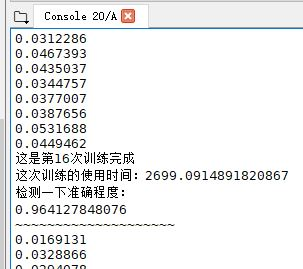

# AlexNet Feature Extraction

I thought Udacity forgot to change RGB to BGR for each figure in database. One reason is that Michael Guerhoy and Davi Frossard performed the [same transmission](http://www.cs.toronto.edu/~guerzhoy/tf_alexnet/). The other is that the natural network gains more confidence after the B and G are changed. The last one is that I cannot get a valid precision over 90% without the change. My function ‘ProcessFigs’ will do the work. 

## Acknowledgement
The author would like to thank the [sample code](http://www.cs.toronto.edu/~guerzhoy/tf_alexnet/myalexnet_forward.py) from Michael Guerhoy and Davi Frossard.  

